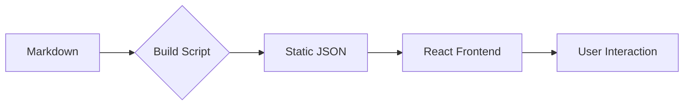

# Welcome to mirakyux blog
# 欢迎来到 mirakyux 的博客

This blog is a custom-built, high-performance static site framework powered by **React**, **Vite**, and **Tailwind CSS**. It is designed for technical writing with native support for advanced documentation features.

这个博客是一个自定义构建的高性能静态站点框架，由 **React**、**Vite** 和 **Tailwind CSS** 提供动力。它专为技术写作而设计，原生支持高级文档功能。

## Key Features | 核心特性

### 1. Visuals & Images | 视觉与图片
We support high-quality images with automatic styling and optimization.

我们支持高质量图片，并提供自动样式处理和优化。


*Example of a futuristic featured image. | 未来感特色图片示例。*

### 2. Technical Writing Essentials | 技术写作必备
We support standard Markdown, GitHub Flavored Markdown (GFM), and advanced syntax highlighting.

我们支持标准 Markdown、GitHub Flavored Markdown (GFM) 以及高级语法高亮。

```typescript
// Example: Smooth spring animations with Framer Motion
export const springConfig = {
  type: "spring",
  stiffness: 400,
  damping: 17
};
```

### 3. Mermaid Diagrams | Mermaid 图表
Visualize your ideas directly in Markdown using Mermaid blocks.

使用 Mermaid 区块直接在 Markdown 中可视化你的想法。



### 4. LaTeX Mathematical Support | LaTeX 数学公式支持
Perfect for scientific and engineering posts, powered by **KaTeX**.

非常适合科学和工程类文章，由 **KaTeX** 强力驱动。

**Inline:** The relationship between mass and energy is $E = mc^2$.

**行内公式：** 质量和能量之间的关系是 $E = mc^2$。

**Block:**
**块级公式：**
$$
\frac{\partial \rho}{\partial t} + \nabla \cdot (\rho \mathbf{u}) = 0
$$

### 5. Smart Content Metrics | 智能内容指标
Each post automatically calculates:

每篇文章都会自动计算：

- **Word Count**: Accurate counts for mixed Chinese and English text.
- **Reading Time**: Intelligent estimation to improve user experience.
- **字数统计**：准确统计中英文混合文本。
- **阅读时长**：智能估算，提升用户体验。

### 6. SEO & Social Ready | SEO 与社交优化
- **Dynamic Meta Tags**: Automated updates for Page Titles and Description.
- **OpenGraph & Twitter Cards**: Optimized for social media sharing.
- **RSS & Sitemap**: Native support for syndication and indexing.

- **动态 Meta 标签**：自动更新页面标题和描述。
- **OpenGraph & Twitter 卡片**：针对社交媒体分享进行优化。
- **RSS & 站点地图**：原生支持内容聚合和搜索引擎索引。

---

## Design Philosophy | 设计理念
The UI follows a **Glassmorphism** aesthetic with a focus on typography and motion. 

UI 遵循**毛玻璃 (Glassmorphism)** 美学，专注于排版和动态效果。

- **Dark Mode**: Fully themed with automatic asset inversion.
- **Ultra Fast**: Zero-latency navigation thanks to pre-processed JSON data.
- **Responsive**: Seamless experience from mobile to desktop.

- **暗黑模式**：全主题适配，支持资产自动反转。
- **极致速度**：得益于预处理的 JSON 数据，实现零延迟导航。
- **响应式设计**：从移动端到桌面端的无缝体验。

Enjoy exploring the content!

祝你探索愉快！
